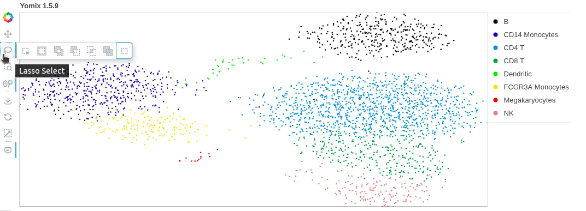
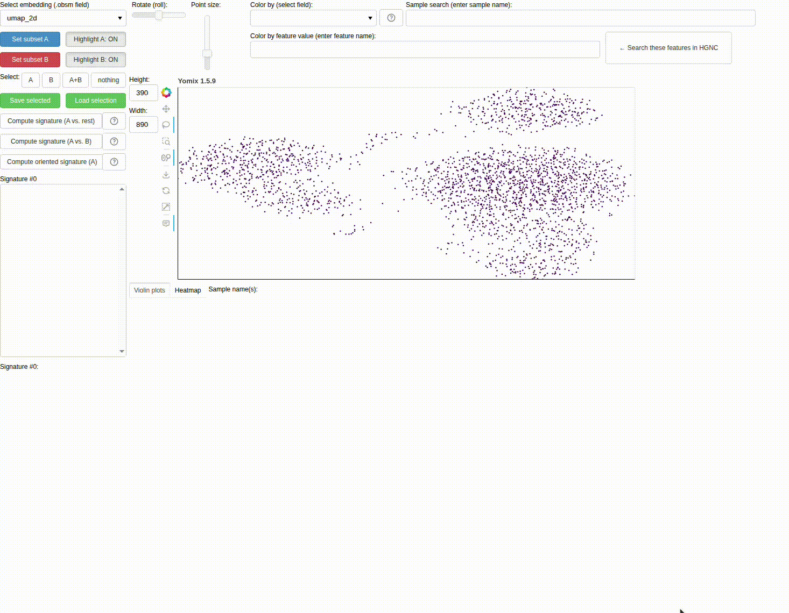

Tutorial
========

Selecting data
--------------

There are two different tools to select data on yomix, with many options:

- **Lasso tool**: Allows free-form selection of data points by drawing a shape around them. You can either use modifier keys for advanced selection:
    - *Ctrl + click*: Intersection with current selection
    - *Shift + click*: Union with current selection
    - *Ctrl + Shift + click*: Subtraction from current selection

    or hold down the left mouse button on the lasso symbol (left side of the plot) to see the different selection mode

- **Legend selection**: Click on items in the legend (right side of the plot) to select all data points belonging to that category. Modifier keys also apply for combining selections, except for Substraction which it will be added in a future version.

    
    Hold down the left mouse button to see the lasso tool options

To reset selection, click on *Select nothing* button on the left side of the screen

Computing signatures
--------------------

Once you have selected a subset of data points, you can compute feature signatures to identify the features that best distinguish your selected subset from the rest of the data or from another subset.
To compute signatures, follow these steps:

1. Select a subset of data points using either the lasso tool or legend selection.
2. Click on the *Set subset A* to save your selection
3. (Optional) Select another subset of data points and click on *Set subset B* to save your selection
4. Click on *Compute signature* (*A Vs Rest* or *A vs B*).
5. Features appeared on the left panel, select some of them to see their distributions in a violin plot.
6. Once the violin plot appeared, you can also select different groups or labels

    
    Compute B cells vs CD14 Monocytes signature on the PBMC dataset

